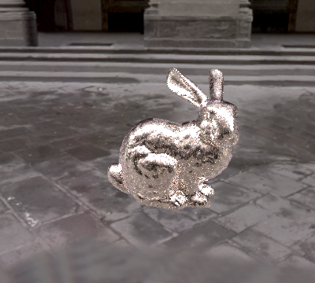

overview
===============

This code base is forked from xxx for study purpose. After reading PBRT book, I plan to do some extension to deepen my understanding.
I found an open source code repo in github: https://github.com/dnx4015/pbrt-importance-sampling
It implement a new material in pbrt-v2 code. since pbrt-v2 and pbrt-v3 has many differences in design, I port the code to pbrt-v3 and hope 
it can help me acquire a better understanding to pbrt-v3 code and book.  I will be very glad if this can help you too and feel free to use it.


Related code
--------------
./src/core/adaptive.cpp
./src/core/adaptive.h
./src/materials/measuredAdaptive.cpp
./src/materials/measuredAdaptive.h

modify code in ./src/core/coreapi.cpp add the following code.

```
 else if (name == "measuredAdaptive")
        material = CreateMeasuredAdaptiveMaterial(mp);
```

simple test scenes
--------------
scene file location: simple-scene/simple-model/adptive-bunny.pbrt
The test scene needs nickel.binary in [MERL BRDF Database](http://people.csail.mit.edu/wojciech/BRDFDatabase/brdfs/).
So you need to download it and add it into  simple-scene/simple-model/brdfs.
Then run the render command to get the result.


pbrt, Version 3
===============

[](https://travis-ci.org/mmp/pbrt-v3)
[](https://ci.appveyor.com/project/mmp/pbrt-v3)

This repository holds the source code to the new version of pbrt that will
be described in the forthcoming third edition of *Physically Based
Rendering: From Theory to Implementation*, by [Matt
Pharr](http://pharr.org/matt), [Wenzel
Jakob](http://www.mitsuba-renderer.org/~wenzel/), and Greg Humphreys.  As
before, the code is available under the BSD license.

Please see the [User's Guide](http://pbrt.org/users-guide.html) for more
information about how to check out and build the system as well as various
additional information about working with pbrt.

Example scenes
--------------

Over 6GB of example scenes are available for download. (Many are new and
weren't available with previous versions of pbrt.) We're trying an
experiment and making them available via git. Run:
```
$ git clone git://git.pbrt.org/pbrt-v3-scenes
```
to get them. We will update this repository as more scenes become
available. (See the `README.md.html file` in the scene distribution for
more information about the scenes and preview images.)

The [pbrt website](http://pbrt.org) has general information about
both *Physically Based Rendering* as well as pbrt-v2, the previous version
of the system.

Building pbrt
-------------

To check out pbrt together with all dependencies, be sure to use the
`--recursive` flag when cloning the repository, i.e.
```bash
$ git clone --recursive https://github.com/mmp/pbrt-v3/
```
If you accidentally already cloned pbrt without this flag (or to update an
pbrt source tree after a new submodule has been added, run the following
command to also fetch the dependencies:
```bash
$ git submodule update --init --recursive
```
pbrt uses [cmake](http://www.cmake.org/) for its build system.  On Linux
and OS X, cmake is available via most package management systems.  For
Windows, or to build it from source, see the [cmake downloads
page](http://www.cmake.org/download/).

* For command-line builds on Linux and OS X, once you have cmake installed,
  create a new directory for the build, change to that directory, and run
  `cmake [path to pbrt-v3]`. A Makefile will be created in that
  current directory.  Run `make -j4`, and pbrt, the obj2pbrt and imgtool
  utilities, and an executable that runs pbrt's unit tests will be built.
* To make an XCode project file on OS X, run `cmake -G Xcode [path to pbrt-v3]`.
* Finally, on Windows, the cmake GUI will create MSVC solution files that
  you can load in MSVC.

If you plan to edit the lexer and parser for pbrt's input files
(`src/core/pbrtlex.ll` and `src/core/pbrtparase.y`), you'll also want to
have [bison](https://www.gnu.org/software/bison/) and
[flex](http://flex.sourceforge.net/) installed. On OS X, note that the
version of flex that ships with the developer tools is extremely old and is
unable to process `pbrtlex.ll`; you'll need to install a more recent
version of flex in this case.

### Debug and Release Builds ###

By default, the build files that are created that will compile an optimized
release build of pbrt. These builds give the highest performance when
rendering, but many runtime checks are disabled in these builds and
optimized builds are generally difficult to trace in a debugger.

To build a debug version of pbrt, set the `CMAKE_BUILD_TYPE` flag to
`Debug` when you run cmake to create build files to make a debug build. For
example, when running cmake from the command lne, provide it with the
argument `-DCMAKE_BUILD_TYPE=Debug`. Then build pbrt using the resulting
build files. (You may want to keep two build directories, one for release
builds and one for debug builds, so that you don't need to switch back and
forth.)

Debug versions of the system run much more slowly than release
builds. Therefore, in order to avoid surprisingly slow renders when
debugging support isn't desired, debug versions of pbrt print a banner
message indicating that they were built for debugging at startup time.

### Build Configurations ###

There are two configuration settings that must be set at compile time. The
first controls whether pbrt uses 32-bit or 64-bit values for floating-point
computation, and the second controls whether tristimulus RGB values or
sampled spectral values are used for rendering.  (Both of these aren't
amenable to being chosen at runtime, but must be determined at compile time
for efficiency).

To change them from their defaults (respectively, 32-bit
and RGB.), edit the file `src/core/pbrt.h`.

To select 64-bit floating point values, remove the comment symbol before
the line:
```
//#define PBRT_FLOAT_AS_DOUBLE
```
and recompile the system.

To select full-spectral rendering, comment out the first of these two
typedefs and remove the comment from the second one:
```
typedef RGBSpectrum Spectrum;
// typedef SampledSpectrum Spectrum;
```
Again, don't forget to recompile after making this change.

