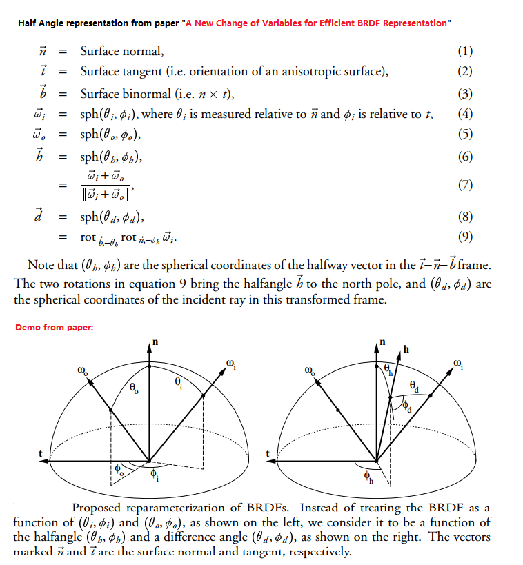
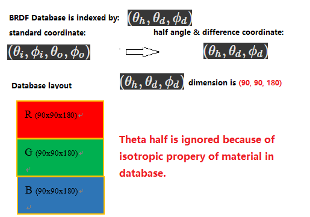

## overview
----
This documents gives some detailed explaination for some concepts.

## MERL BRDF Database 
----
The [MERL BRDF database]( http://people.csail.mit.edu/wojciech/BRDFDatabase/) contains reflectance functions of 100 different materials.
Each reflectance function is stored as a densely measured Bidirectional Reflectance Distribution Function (BRDF).
These data stored in "halfangle-difference" format.

## Half-Angle Difference coordinate
----

